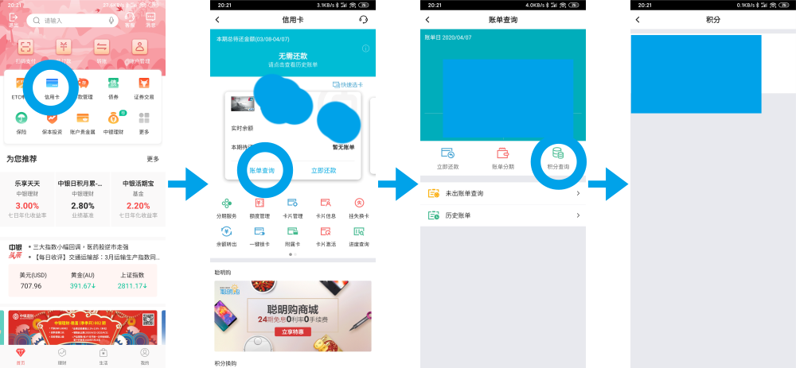
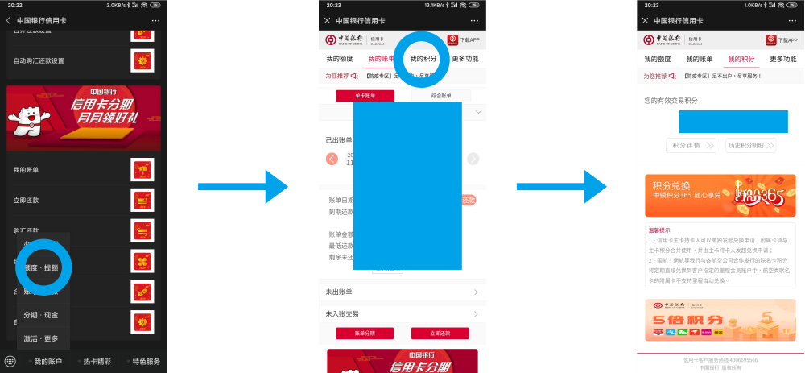
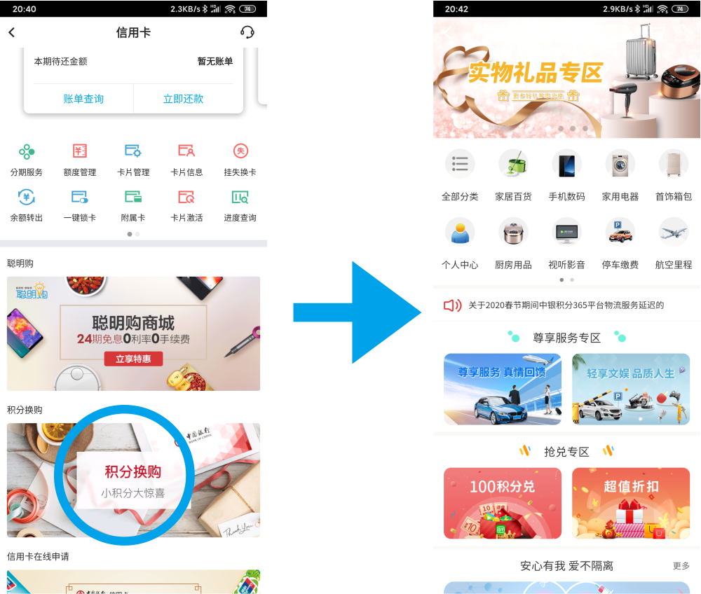
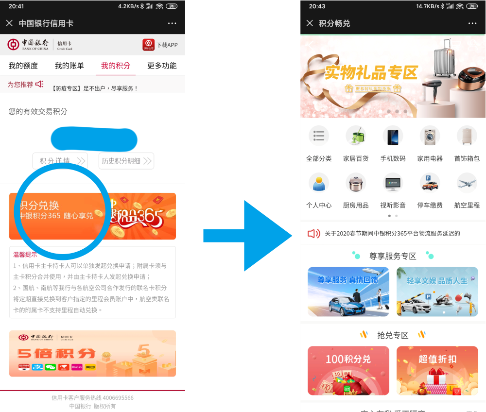
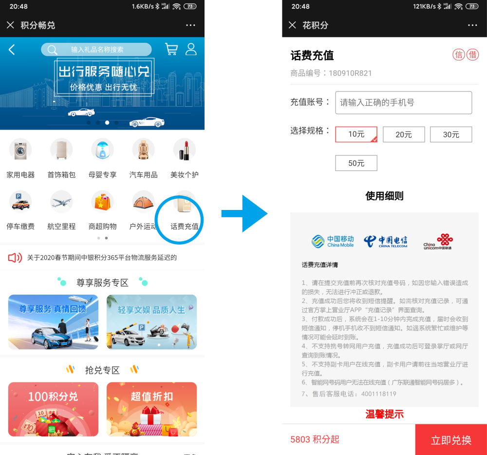
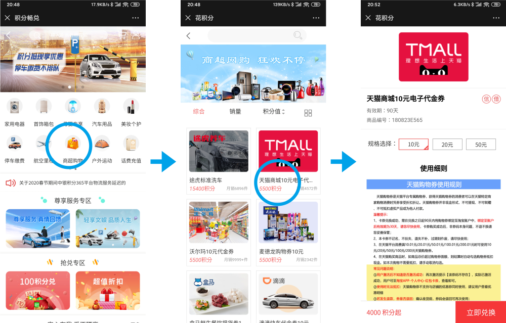
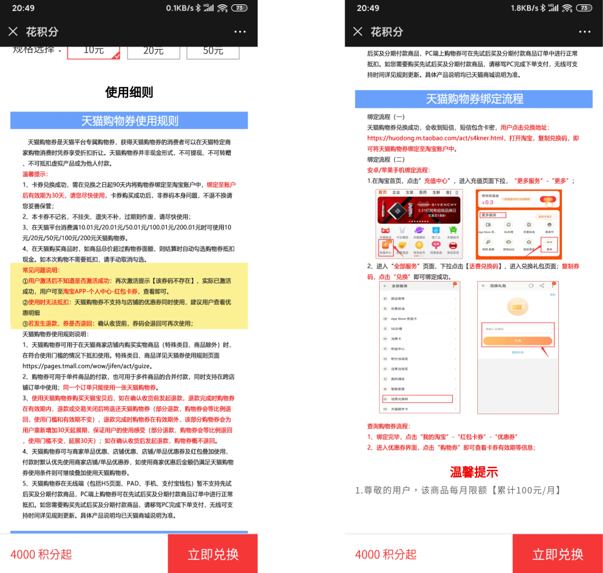
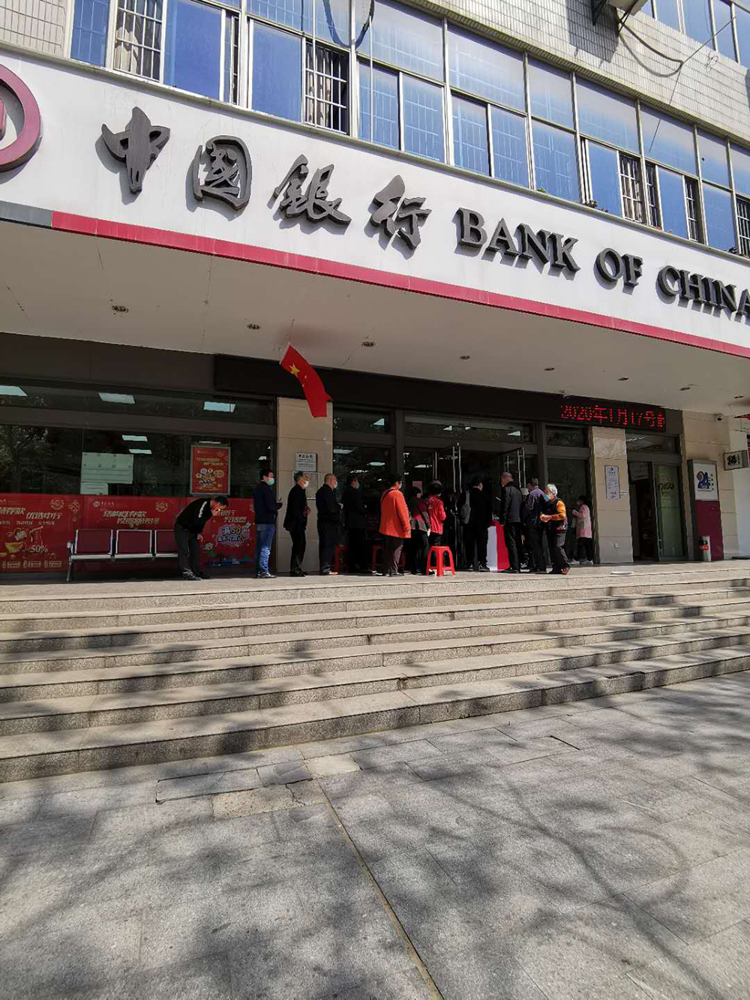
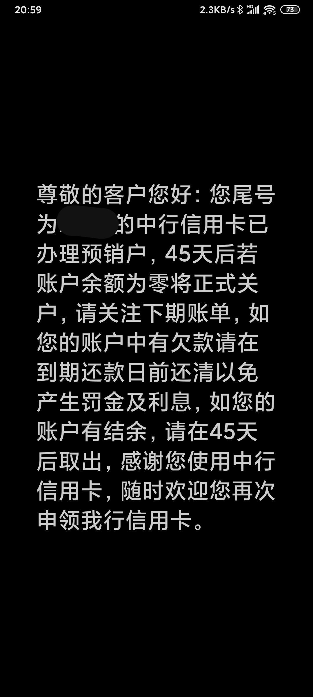
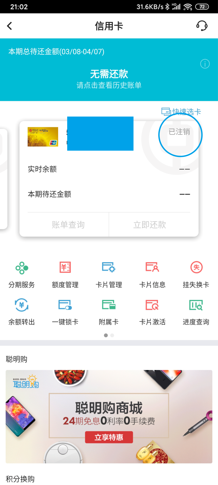

# 如何注销我的信用卡：中国银行信用卡销卡记录

## 前言

手上有两张共享额度的中行信用卡，额度不到20000，基本上够用，一张是万事达的金卡，一张是visa的白金卡。
办卡的理由很简单，就是为了出国旅游的时候消费，一方面中行的海淘活动也比较给力，另外万事达和visa都备上，不管去哪个国家都能够使用。另外，这两张卡可以消费几笔免年费，所以平时海淘，网购也都会用这两张卡。
不过，这几年因为各种原因，没有再出国，汇率不合适海淘的次数也变少。两张共享额度的卡，平时管理的麻烦也显现出来。

碰巧，前几天银行发来短信，说我其中的一张卡已经要过期了，需要重新寄一张新卡过来，之前办卡的地址也换了，需要跟客服去更改，想到种种不便，决定注销掉这张卡。

## 第一步 积分

### 如何查询积分。

中国银行app——信用卡——账单查询——积分查询

中国银行信用卡公众号菜单栏——我的账户——账单还款——我的账单——我的积分

### 如何花掉积分
   
app信用卡页面下拉——积分换购

公众号的积分页面——积分兑换

进入积分换购之后，app和公众号的基本上都一样，这里的演示就以app为例
积分页面有很多各式各样的商品可以换，当然你可以挑选你喜欢的商品直接兑换。
这里主要说一下我认为最划算应该是这两个：
    1. 兑换话费：中部滑动栏的第二页 最后一项

       1. 大概5800积分起（实际要6000多分）可以兑换10元话费，不过限制就是每个月最多智能兑换100元。
    2. 兑换天猫代金券：中部滑动栏的第二页 商超购物 限额也是每月100元
   
       1. 进去之后很容易就找到天猫的电子代金券
       2. 4000积分（实际上5000多分）可以兑换10元代金券，有10元、20元、50元三个面额，都是满10.01 20.01 50.01使用。
       3. 兑换完成后会短信发给你一个兑换码，需要在90天内绑定到淘宝账户，且绑定后30天内必须使用。
       4. 如果在天猫买完东西后退货，代金券也会退回。
       5. 具体的使用方式看下图
   
## 第二步 去银行

由于疫情的关系，我们这里的银行都需要实行扫码登记和测量体温，而且实行人流控制。
   
经过询问才知道，营业厅是没办法办理信用卡注销业务的，需要自己大信用卡客服电话，而且并不是现在特殊时期不能办，而是银行营业厅没有这项业务。
所以我没能和大爷大妈们一起排队。

## 第三步 打电话
直接电话4006695566，人工客服。跟客服说明之后，顺利注销这张信用卡。
而且
>1. 是否会影响到第二张信用卡的使用？
>   客服回答：完全不会。
>2. 手上的卡怎么办？
>    客服回答：自己剪掉。
>3. 还会寄卡过来吗？
>   客服回答：不会

通话完成之后，手机收到办理成功的短信。
   
中国银行信用卡公众号里面已经找不到这张卡了

app里面卡的状态是注销
   

# 第四步 解绑
整个办理过程只是一个电话的时间，但还需要等待45天才能完全的注销，这段时间你可以把信用卡所涉及到的费用全部处理完。
除此之外，建议在各个支付平台把这张卡的支付全部都解绑。
至此，一个完整的信用卡注销流程就完成了。

