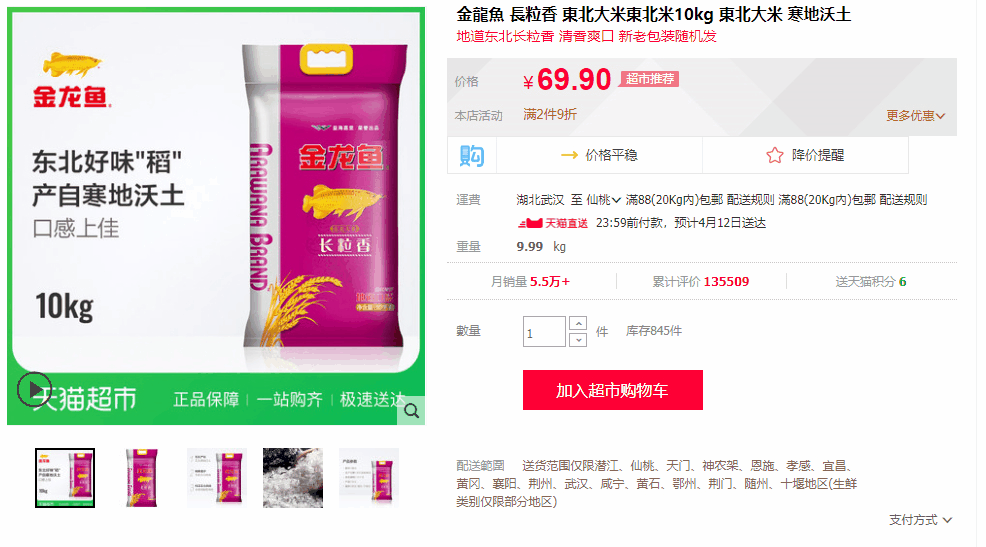
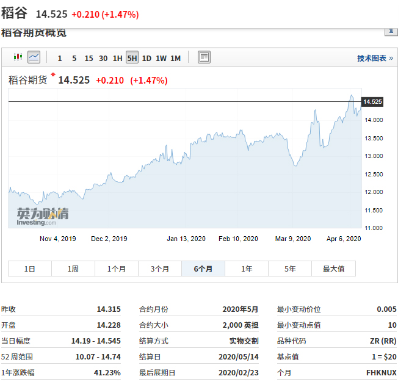

# 好多人都在囤米，仙桃大米会涨价吗？

最近打开微信，你是不是也吓了一跳：大家不是在抢米，就是被提醒抢米？
新冠肺炎疫情蔓延全球，世界大宗农产品期货价格上涨，加之有媒体报道一些国家开始限制本国农产品出口，个别担忧我国粮食保障的声音出现。

## 甚嚣尘上的传言？

不少家庭微信群、长辈朋友圈、甚至很多小道公众号，都有传言新冠肺炎、自然灾害、股灾等可能导致粮食危机，出现了“囤粮三个月”的说法。甚至有“大米限购”“粮食断供”的说法，可事实究竟怎样？粮食安全是否有保障？

## 仙桃各大商超实情

  （供应情况、价格，配超市大米图）

## 电商平台实况

上图为各大电商平台在售的平价大米

上图为京东销量最好的“十月稻田长粒香东北大米10kg装”，目前的售价为人民币78元，折合3.9元/斤， 从历史价格来看，近半年来的价格均维持在70元左右上下浮动，并没有出现大范围的上涨。
需要说明的是，网上售卖的大米一般以偏中高档，由于大米运输成本较高，2元每斤左右的大米并不是网络销售的主力，包括京东、天猫在内的主流互联网B2C平台，3元以下的大米也能找到不少。

## 国家粮食物资储备部门：目前没有动用中央储备粮，不建议囤米

虽然相关部门已即时辟谣，但抢米、囤积米的市民仍有不少。不少人纷纷猜测，国内大米真的充足吗？是否真的会涨价？

4月4日，农业农村部发展规划司司长魏百刚在国务院联防联控机制新闻发布会上说，我国粮食产量丰、库存足，国家有充分的调控手段平抑粮价，没有必要抢购囤积。发布会上集中回应了如下几点：

>1. 我国粮食现状如何？
粮食产量连续五年稳定在1.3万亿斤以上；人均粮食占有量2019年超过470公斤，远高于人均400公斤的国际粮食安全标准线；小麦和稻谷库存大体相当于全国人民一年的消费量。
>2. 国际粮价为何上涨？
近期国际粮价上涨更多是疫情造成恐慌性消费的结果，对国内粮价的影响有限，一旦国内粮食市场出现波动，我国有充分的调控手段进行平抑。
>3. 应急保障有何防线？
有充足的原粮储备；人口集中的大中城市和价格易波动地区建立了能够满足10到15天的成品粮储备；布局建设了一批应急加工企业、应急供应网点、应急配送中心和应急储运企业。

## 国际稻谷期货价格走势

稻谷期货走势图（2019年10月—2020年4月）
上图为2019年10月到2020年4月国际稻谷期货价格的走势图，可以看到国际稻谷价格确实在半年内处于持续走高的态势。主要原因除了今年一月份以来的疫情，还有去年年末的蝗灾以及今年四月东南亚的干旱天气，再加上目前很多国家限制粮食出口，所以国际粮价波动很大。可是有人非要纠结，非要吃“进口粮食”，那你大概率是要承担这一波涨价的。不过国际粮价≠国内粮价，进口大米仅仅占我国大米消费约1%，而且大多数是泰国大米，日本大米等高价大米，目前受到餐饮业等消费需求降低的影响，这类大米的需求也比往年同期要小。另外别忘了，18亿亩的耕地红线一直都在，而且寸土不让。

## 总结

1. 大米涨价完全是谣传吗？无法否定国际米价一直在上涨，国外的粮食情况不容乐观。
2. 国内的米价一直都很稳定，一方面是国家粮食储备充足，也能有效应对重大自然灾害和突发事件的考验。另外，“人误地一时、地误人一年”的历史教训，我们这个民族比谁都要深刻。所以包括湖北省在内的春耕早就有条不紊的开始了，只要粮仓不出问题，春耕复产顺利进行，粮食就不会短缺
3. 身处仙桃的普通老百姓，有没有必要囤粮食？
   1. 如果你很在乎粮食价格10%到20%的波动，那么短期看着价格合适，买几袋放家里也无妨，但没必要买太多。
   2. 如果你想投资？奉劝你还是去期货市场吧，没必要盯着市场上的现货。
   3. 一般老百姓没必要囤积大米，大米的保质期一般为6个月，屯多了没有用。
   4. 不知道上次屯了几千吨食盐的那位现在家里的盐吃完了没有，我们总要吸取一些教训吧！

最后，请大家节约粮食，不要浪费每一粒米。
